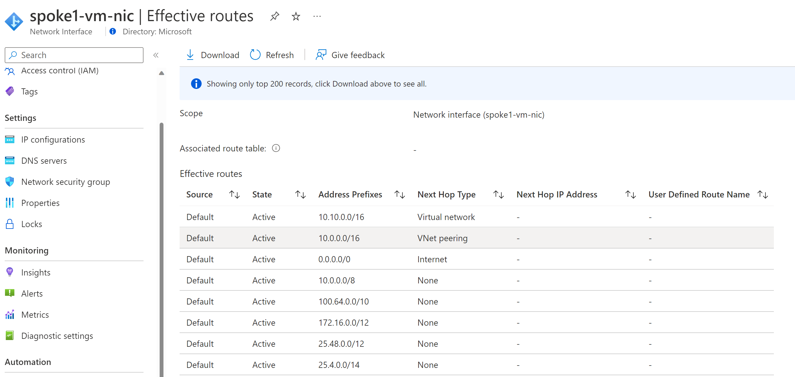
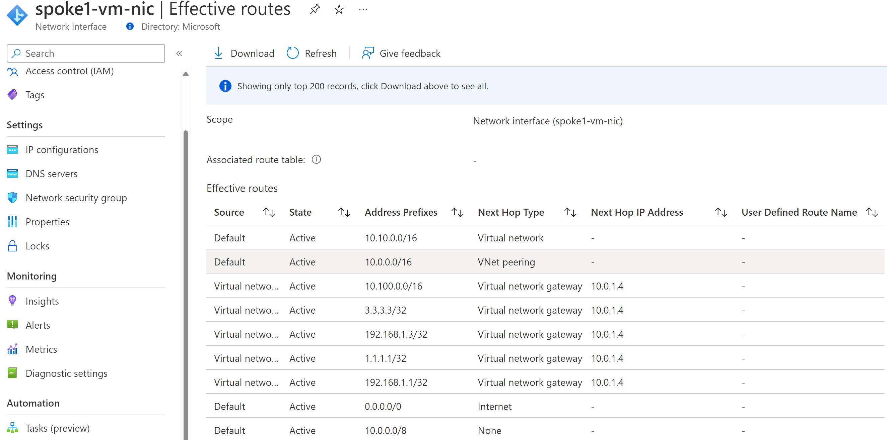

# Azure Hybrid Networking Routing Lab Series

## Lab 2 - Deploying Azure Route Server in Hub VNET and BGP peering with Cisco CSR in Azure

### Introduction

This lab deploys Azure Route Server in Hub VNET and is BGP peered with Cisco CSR in Azure Hub. A new spoke is peered with hub with spoke using remote gateways to learn routes from Azure Route Server (ARS). Connectivity between VM in spoke and on-prem test VM is validated after route injection in Spoke VNET via ARS.

> *This lab is for testing/learning purposes only and should not be considered production configurations*

### Networking Architecture


### Expected Traffic Flow after lab 2 deployment


### New Components in lab 2

- Azure Hub Environment
  - Azure Route Server (routeserver-hub) (10.0.2.4 and 10.0.2.5) in subnet 10.0.0.2/26
  - Spoke VNET (spoke1vnet) with address space 10.10.0.0/16
  - VM (spoke1-vm) in Spoke VNET (10.10.0.4)

- Connectivity
  - BGP Peering between ARS (10.0.2.4 & 5) and CSR (10.0.1.4)

### Components from previous labs

- Azure Hub Environment
  - hub-vnet(10.0.0.0/16)
  - csr-internal (10.0.1.0/24) and csr-external(10.0.0.0/24) subnets in hub-vnet  
  - azure-csr Cisco CSR (tunnel ip 192.168.1.1) with public ip (azure-csr-pip) and private ips: external interface (10.0.0.4 from csr-external subnet) and internal interface (10.0.1.4 from csr-internal)
  - azure-static-rt UDR on csr-internal and csr-external with only route pointing 0/0 to Internet

- On-premise Environment (simulated on Azure)
  - on-prem vnet (10.100.0.0/16)
  - csr-internal (10.100.1.0/24) and csr-external(10.100.0.0/24) subnets in on-prem vnet
  - onprem-csr Cisco CSR (tunnel ip 192.168.1.3) with public ip (onprem-csr-pip) and private ips: external interface (10.100.0.4 from csr-external subnet) and internal interface (10.100.1.4 from csr-internal)
  - test-vm-subnet (10.100.10.0/24) with onprem-test-vm (10.100.10.10)
  - onprem-static-rt UDR on csr-internal and csr-external with only route pointing 0/0 to Internet
  - onprem-vm-rt UDR on test-vm-subnet

- Connectivity
  - IPSec (IKEV2) VPN tunnel between azure-csr and onprem-csr
  - BGP over IPSec between azure-csr and onprem-csr

- VNET Peerings
  - Spoke (spoke1vnet) Peered to Hub (hubvnet) with Spoke using remote-gateways in hubvnet.

### Deployment Steps

You can use either cloud shell or Azure CLI. While Azure Bastion can be used to access VMs, in this lab Serial Console is used for simplicity.

Set Resource Group Variables. Use same values from previous lab

```bash
locazure="eastus"
rgazure="azure-rg-lab"

loconprem="westus2"
rgonprem="onprem-rg-lab"
```

#### Deploy Azure Route Server in Hub (hubvnet)

```azurecli
#create route server subnet
az network vnet subnet create -g $rgazure --vnet-name hubvnet -n RouteServerSubnet --address-prefixes 10.0.2.0/26 -o none

az network public-ip create \
    --name ars-hub-pip \
    --resource-group $rgazure \
    --version IPv4 \
    --sku Standard \
    --output none --only-show-errors

subnet_id=$(az network vnet subnet show \
    --name RouteServerSubnet \
    --resource-group $rgazure \
    --vnet-name hubvnet \
    --query id -o tsv) 

az network routeserver create \
    --name routeserver-hub \
    --resource-group $rgazure\
    --hosted-subnet $subnet_id \
    --public-ip-address ars-hub-pip \
 --output none

```

#### Deploy Spoke1 VNET with test VM, Peer Spoke1vnet to hubvnet

The spoke1vnet will be peered to hubvnet and will use remote gateways in hubvnet.

```azurecli

# create subnet for spoke1-vm
az network vnet create --address-prefixes 10.10.0.0/16 -n spoke1Vnet -g $rgazure --subnet-name vm-subnet --subnet-prefixes 10.10.0.0/24 -o none

#create NSG for Subnet and attach to Subnet
az network nsg create -g $rgazure -n "vm-subnet-spoke1-nsg" -l $locazure -o none
az network vnet subnet update -g $rgazure -n vm-subnet --vnet-name spoke1Vnet --network-security-group "vm-subnet-spoke1-nsg" -o none

#peer spoke1vnet to hubvnet
hubid=$(az network vnet show -g $rgazure -n hubvnet --query id -o tsv)
spoke1id=$(az network vnet show -g $rgazure -n spoke1Vnet --query id -o tsv)

#create vnet peering
az network vnet peering create -n "hubTOspoke1" -g $rgazure --vnet-name hubvnet --remote-vnet $spoke1id --allow-vnet-access --allow-forwarded-traffic --allow-gateway-transit -o none
az network vnet peering create -n "spoke1TOhub" -g $rgazure --vnet-name spoke1Vnet --remote-vnet $hubid --allow-vnet-access --allow-forwarded-traffic --use-remote-gateways -o none

#deploy test VM in spoke 1
az network nic create -g $rgazure --vnet-name spoke1Vnet --subnet vm-subnet -n "spoke1-vm-nic" -o none
az vm create -n spoke1-vm \
    -g $rgazure \
    --image ubuntults \
    --size Standard_D2S_v3 \
    --nics spoke1-vm-nic \
    --authentication-type password \
    --admin-username azureuser \
    --admin-password " your password \ here" \
    -o none \
    --only-show-errors

```

#### Before BGP Peering ARS to CSR check effective routes on spoke1vm and routes learned/advertised by ARS

Check effective route on spoke1-vm-nic



spoke1-vm only knows about Hub via Peering. It doesn't have routes to on-prem.

#### BGP Peer routeserver-hub (ARS) with azure-csr (CSR) in hubvnet

```azurecli

az network routeserver peering create \
    --name hub-ars-csr \
    --peer-ip 10.0.1.4 \
    --peer-asn 65001 \
    --routeserver routeserver-hub \
    --resource-group $rgazure \
    --output none

```

Check learned route on bgp peer. Expected empty output since no other BGP peering done yet.

```azurecli

az network routeserver peering list-learned-routes \
    --name hub-ars-csr \
    --routeserver routeserver-hub \
    --resource-group $rgazure

Output:
{
  "RouteServiceRole_IN_0": [],
  "RouteServiceRole_IN_1": [],
  "value": null
}

```

### BGP Peer azure-csr (CSR) with routeserver-hub (ARS) in hubvnet

Login to azure-csr via Serial Console. Navigate to `en` and then `conf t`
Paste in below configuration, one block at a time in config mode i.e `azure-csr(config)#`

```bash

#static route server for ARS peers 10.0.2.5, 10.0.2.4
ip route 10.0.2.4 255.255.255.255 10.0.1.1
ip route 10.0.2.5 255.255.255.255 10.0.1.1

router bgp 65001
 bgp log-neighbor-changes
 neighbor 10.0.2.5 remote-as 65515
 neighbor 10.0.2.5 ebgp-multihop 255
 neighbor 10.0.2.4 remote-as 65515
 neighbor 10.0.2.4 ebgp-multihop 255
exit

```

After BGP Peering with ARS, serial console will show neighbor up messages

```bash

*Oct 12 07:50:15.534: %BGP-5-ADJCHANGE: neighbor 10.0.2.4 Up 
*Oct 12 07:50:15.747: %BGP-5-ADJCHANGE: neighbor 10.0.2.5 Up

```

#### Validate BGP Learned routes

##### Validate azure-csr learned routes

Run `show ip bgp summary` and `show ip bgp`

```bash

azure-csr#show ip bgp summary
BGP router identifier 1.1.1.1, local AS number 65001
BGP table version is 25, main routing table version 25
8 network entries using 1984 bytes of memory
12 path entries using 1632 bytes of memory
3/3 BGP path/bestpath attribute entries using 864 bytes of memory
2 BGP AS-PATH entries using 48 bytes of memory
0 BGP route-map cache entries using 0 bytes of memory
0 BGP filter-list cache entries using 0 bytes of memory
BGP using 4528 total bytes of memory
BGP activity 9/1 prefixes, 39/27 paths, scan interval 60 secs
9 networks peaked at 00:09:20 Oct 13 2022 UTC (13:39:04.315 ago)

Neighbor        V           AS MsgRcvd MsgSent   TblVer  InQ OutQ Up/Down  State/PfxRcd
10.0.2.4        4        65515    2067    2006       25    0    0 1d05h           3
10.0.2.5        4        65515    2062    2002       25    0    0 1d05h           3
192.168.1.3     4        65003    2480    2485       25    0    0 1d13h           3

azure-csr#show ip bgp
BGP table version is 10, local router ID is 1.1.1.1
Status codes: s suppressed, d damped, h history, * valid, > best, i - internal, 
              r RIB-failure, S Stale, m multipath, b backup-path, f RT-Filter, 
              x best-external, a additional-path, c RIB-compressed, 
              t secondary path, L long-lived-stale,
Origin codes: i - IGP, e - EGP, ? - incomplete
RPKI validation codes: V valid, I invalid, N Not found

     Network          Next Hop            Metric LocPrf Weight Path
 *>   1.1.1.1/32       0.0.0.0                  0         32768 i
 *>   3.3.3.3/32       192.168.1.3              0             0 65003 i
 *    10.0.0.0/16      10.0.2.5                               0 65515 i
 *                     10.0.2.4                               0 65515 i
 *>                    0.0.0.0                  0         32768 i
 *    10.10.0.0/16     10.0.2.5                               0 65515 i
 *>                    10.0.2.4                               0 65515 i
 *>   10.100.0.0/16    192.168.1.3              0             0 65003 i
 *>   192.168.1.1/32   0.0.0.0                  0         32768 i
 r>   192.168.1.3/32   192.168.1.3              0             0 65003 i
azure-csr#

```

azure-csr has learned 10.0.0.0/16 and 10.10.0.0/16 routes from routeserver-hub (ARS) with AS Number 65515

##### Validate onprem-csr learned routes

```bash

onprem-csr-vm#show ip bgp
BGP table version is 8, local router ID is 3.3.3.3
Status codes: s suppressed, d damped, h history, * valid, > best, i - internal, 
              r RIB-failure, S Stale, m multipath, b backup-path, f RT-Filter, 
              x best-external, a additional-path, c RIB-compressed, 
              t secondary path, L long-lived-stale,
Origin codes: i - IGP, e - EGP, ? - incomplete
RPKI validation codes: V valid, I invalid, N Not found

     Network          Next Hop            Metric LocPrf Weight Path
 *>   1.1.1.1/32       192.168.1.1              0             0 65001 i
 *>   3.3.3.3/32       0.0.0.0                  0         32768 i
 *>   10.0.0.0/16      192.168.1.1              0             0 65001 i
 *>   10.10.0.0/16     192.168.1.1                            0 65001 65515 i
 *>   10.100.0.0/16    0.0.0.0                  0         32768 i
 r>   192.168.1.1/32   192.168.1.1              0             0 65001 i
 *>   192.168.1.3/32   0.0.0.0                  0         32768 i
onprem-csr-vm#

onprem-csr-vm has learned 10.10.0.0/16 (spoke1vnet) route from 65515

```

##### Validate routeserver-hub (ARS) learned routes and advertised routes

Check Advertised routes

```bash

az network routeserver peering list-advertised-routes  \
    --name hub-ars-csr \
    --routeserver routeserver-hub \
    --resource-group $rgazure

```

Json output -> converted to table for readability using json2table.com


Check Learned routes

```bash
az network routeserver peering list-learned-routes \
    --name hub-ars-csr \
    --routeserver routeserver-hub \
    --resource-group $rgazure
```

Json output -> converted to table for readability


ARS in hub has learned routes to on-prem via azure CSR.

##### Validate spoke1-vm effective routes after BGP peering of ARS and CSR

As you can see below Spoke 1 has learned routes to on-prem via Azure Route Server programming routes into NIC



#### Validate Connectivity via Ping between spoke1-vm to onprem-csr-vm and onprem-test-vm (traceroute)

Ping from spoke1-vm to onprem-test-vm

```bash

azureuser@spoke1-vm:~$ ping 10.100.10.10 -c 4
PING 10.100.10.10 (10.100.10.10) 56(84) bytes of data.
64 bytes from 10.100.10.10: icmp_seq=1 ttl=62 time=70.7 ms
64 bytes from 10.100.10.10: icmp_seq=2 ttl=62 time=71.7 ms
64 bytes from 10.100.10.10: icmp_seq=3 ttl=62 time=75.6 ms
64 bytes from 10.100.10.10: icmp_seq=4 ttl=62 time=73.9 ms

--- 10.100.10.10 ping statistics ---
4 packets transmitted, 4 received, 0% packet loss, time 3004ms
rtt min/avg/max/mdev = 70.797/73.040/75.627/1.881 ms
azureuser@spoke1-vm:~$ 

```

Traceroute from spoke1-vm to onprem-test-vm shows route taken from spoke1-vm -> azure-csr -> onprem-csr-vm -> onprem-test-vm

```bash

azureuser@spoke1-vm:~$ traceroute 10.100.10.10
traceroute to 10.100.10.10 (10.100.10.10), 30 hops max, 60 byte packets
 1  10.0.1.4 (10.0.1.4)  4.738 ms  4.689 ms  4.667 ms
 2  192.168.1.3 (192.168.1.3)  79.322 ms  79.230 ms  79.209 ms
 3  * 10.100.10.10 (10.100.10.10)  79.170 ms *
azureuser@spoke1-vm:~$ 

```

Ping from spoke1-vm to onprem-csr-vm

```bash

azureuser@spoke1-vm:~$ ping 10.100.0.4 -c 4
PING 10.100.0.4 (10.100.0.4) 56(84) bytes of data.
64 bytes from 10.100.0.4: icmp_seq=1 ttl=254 time=69.1 ms
64 bytes from 10.100.0.4: icmp_seq=2 ttl=254 time=68.1 ms
64 bytes from 10.100.0.4: icmp_seq=3 ttl=254 time=67.6 ms
64 bytes from 10.100.0.4: icmp_seq=4 ttl=254 time=69.4 ms

--- 10.100.0.4 ping statistics ---
4 packets transmitted, 4 received, 0% packet loss, time 3001ms
rtt min/avg/max/mdev = 67.683/68.625/69.487/0.804 ms
azureuser@spoke1-vm:~$ 
```

Ping from onprem-test-vm to spoke1-vm

```bash
azureuser@onprem-test-vm:~$ ping 10.10.0.4 -c 4
PING 10.10.0.4 (10.10.0.4) 56(84) bytes of data.
64 bytes from 10.10.0.4: icmp_seq=1 ttl=62 time=71.7 ms
64 bytes from 10.10.0.4: icmp_seq=2 ttl=62 time=70.9 ms
64 bytes from 10.10.0.4: icmp_seq=3 ttl=62 time=72.9 ms
64 bytes from 10.10.0.4: icmp_seq=4 ttl=62 time=76.8 ms

--- 10.10.0.4 ping statistics ---
4 packets transmitted, 4 received, 0% packet loss, time 3003ms
rtt min/avg/max/mdev = 70.904/73.117/76.878/2.310 ms

```

Ping from onprem-csr-vm to spoke1-vm

```bash

onprem-csr-vm#ping 10.10.0.4
Type escape sequence to abort.
Sending 5, 100-byte ICMP Echos to 10.10.0.4, timeout is 2 seconds:
!!!!!
Success rate is 100 percent (5/5), round-trip min/avg/max = 67/70/75 ms
onprem-csr-vm#

```

#### Validation

- Ping from spoke1-vm (10.10.0.4) to onprem-test-vm (10.100.10.10) and vice-versa
- Traceroute from spoke1-vm (10.10.0.4) to 10.100.10.10 showing hops
- Ping between spoke1-vm and CSRs on azure and on-prem
- Route to Internet from spoke1-vm directly goes out from Azure

#### Conclusion

This lab illustrated how Azure Route Server injects route into spoke VNET after learning from BGP peer, azure-csr in this case. All the routes in spoke are dynamic.
