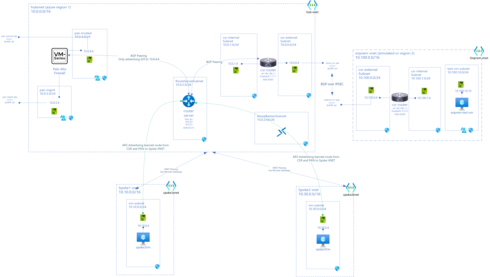
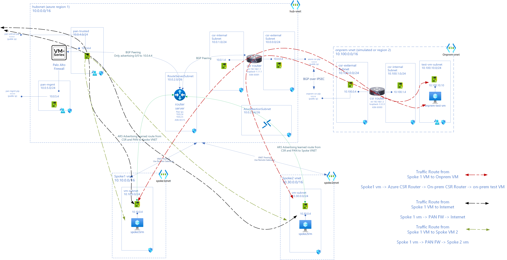

# Azure Hybrid Networking Routing Lab Series

## Lab 3 - Deploying PaloAlto VM Series Firewall in Hub VNET and BGP peering PAN with Cisco CSR and Azure Route Server in Azure

### Introduction

This lab deploys PaloAlto VM Series Firewall (PAN) in Hub VNET and is BGP peered with Cisco CSR and Azure Route Server in Azure Hub. Goal of this lab is to force 0/0 traffic originating from spoke VNETs via PAN.

North-South traffic (to internet) via PAN

East-West traffic (to on-prem and other VNETs) bypasses PAN

> *This lab is for testing/learning purposes only and should not be considered production configurations*

### Networking Architecture

### Expected Traffic Flow Post lab 3 deployment

### New Components in lab 3

Azure Hub Environment

- Palo Alto Firewall VM (10.0.4.4) with interfaces in pan-mgt (10.0.5.0/24) subnet and pan-trusted (10.0.4.0/24) subnet
- Spoke VNET (spoke2vnet) with address space 10.30.0.0/16
- VM (spoke2-vm) in Spoke VNET (10.30.0.4)

Connectivity

- BGP Peering between PAN (10.0.4.4) and ARS (10.0.2.4 and 10.0.2.5)
- BGP Peering between PAN (10.0.4.4) and CSR (10.0.1.4)

VNET Peerings

- Spoke (spoke2vnet) Peered to Hub (hubvnet) with spoke2vnet using remote-gateways in hubvnet

### Existing components from previous labs

Azure Hub Environment

- hub-vnet(10.0.0.0/16)
- csr-internal (10.0.1.0/24) and csr-external(10.0.0.0/24) subnets in hub-vnet  
- azure-csr Cisco CSR (tunnel ip 192.168.1.1) with public ip (azure-csr-pip) and private ips: external interface (10.0.0.4 from csr-external subnet) and internal interface (10.0.1.4 from csr-internal)
- azure-static-rt UDR on csr-internal and csr-external with only route pointing 0/0 to Internet
- Azure Route Server (10.0.2.4 and 10.0.2.5) in subnet 10.0.0.2/26
- Spoke VNET (spoke1vnet) with address space 10.10.0.0/16
- VM (spoke1-vm) in Spoke VNET (10.10.0.4)

On-premise Environment (simulated on Azure)

- on-prem vnet (10.100.0.0/16)
- csr-internal (10.100.1.0/24) and csr-external(10.100.0.0/24) subnets in on-prem vnet
- onprem-csr Cisco CSR (tunnel ip 192.168.1.3) with public ip (onprem-csr-pip) and private ips: external interface (10.100.0.4 from csr-external subnet) and internal interface (10.100.1.4 from csr-internal)
- test-vm-subnet (10.100.10.0/24) with onprem-test-vm (10.100.10.10)
- onprem-static-rt UDR on csr-internal and csr-external with only route pointing 0/0 to Internet
- onprem-vm-rt UDR on test-vm-subnet

- Connectivity
  - IPSec (IKEV2) VPN tunnel between azure-csr (10.0.0.4) and onprem-csr (10.100.0.4)
  - BGP over IPSec between azure-csr (10.0.0.4) and onprem-csr (10.100.0.4)
  - BGP Peering between ARS (10.0.2.4 & 5) and CSR (10.0.1.4)

- VNET Peerings
  - Spoke (spoke1vnet) Peered to Hub (hubvnet) with spoke1vnet using remote-gateways in hubvnet.
